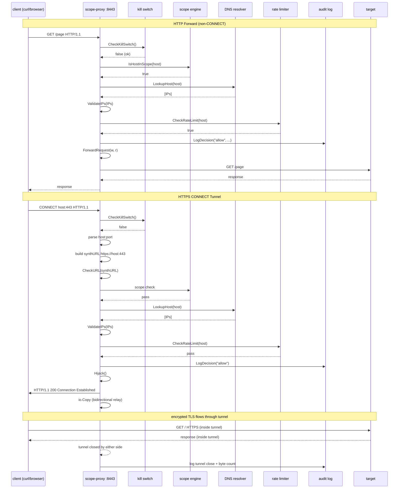
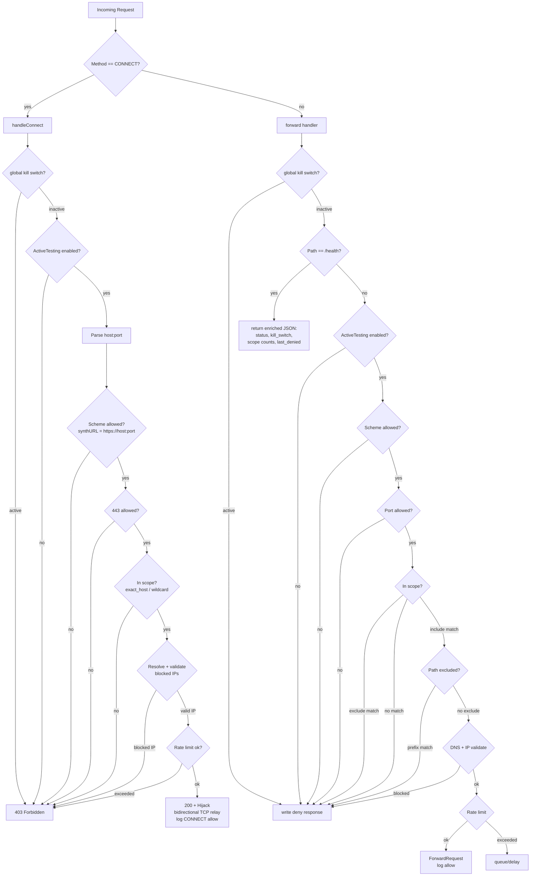

# ScopePilot Architecture Diagrams

## Container Topology (Current State)

```mermaid
graph TB
    subgraph "macOS Host"
        CLI[pentest CLI<br/>discover, scan, watch, status]
        CURL[curl / browser<br/>http_proxy=:8443]
    end

    subgraph "scopepilot-net (bridge, internal)"
        SP[scope-proxy container<br/>:8443 proxy<br/>:9090 MCP<br/>read-only rootfs<br/>cap_drop ALL]
        FIX[fixture container<br/>:8080 test HTTP<br/>synthetic endpoints]
    end

    subgraph "Safety Components"
        KS[kill switch<br/>global halt]
        RL[rate limiter<br/>per-host token bucket]
        AUD[audit log<br/>recent 10k entries]
        SCOPE[scope engine<br/>exact_host + wildcard]
        DNS[DNS resolver<br/>immediate resolution<br/>rebinding protection]
    end

    subgraph "External World"
        TARGET[in-scope targets<br/>example.com<br/>api.example.com<br/>sub.example.com]
        BLOCKED[out-of-scope<br/>blocked by gate]
    end

    CLI -->|MCP JSON-RPC :9090| SP
    CURL -->|CONNECT tunnel :8443| SP
    SP -->|scope validation| SCOPE
    SP -->|isActive?| KS
    SP -->|Allow(host)?| RL
    SP -->|log decision| AUD
    SP -->|resolve + validate| DNS
    SP -->|forward / deny| TARGET
    SP -->|deny| BLOCKED
    FIX -->|test requests| SP
```

## Request Flow (CONNECT Tunnel + Forward)



## Scope Decision Tree (Updated with CONNECT)



## Threat Model — Trust Boundaries

| Boundary | From | To | Risk | Mitigation |
|----------|------|----|------|------------|
| T1 | macOS host | Podman VM | Process isolation escape | Rootless Podman, no-new-privs |
| T2 | Container | Container | Network lateral movement | Internal bridge, no gateway |
| T3 | Scope-proxy | External (HTTPS) | Out-of-scope data exfiltration | Safety chain on CONNECT + forward |
| T4 | MCP client | MCP server | Unauthorized tool invocation | Bearer token auth + audit |
| T5 | curl/browser | Proxy :8443 | Proxy bypass | Localhost-only bind |
| T6 | CONNECT tunnel (opaque TCP) | Target | Path-prefix scope bypass | Documented limitation |
